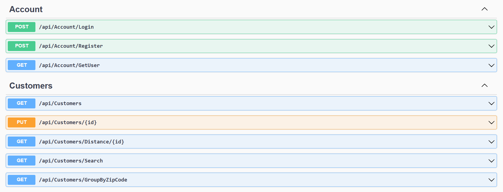
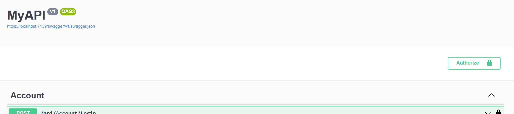

# FidenzCustomers

## Application Users

**Admin User**

Email: dante@gmail.com
Password: Test@123

**API User**

Email: johndoe@gmai.com
Password: Test@123

## Application Features

- An admin can view all the customers in the application.
- Other API calls can be called by any of the users.
- Once an user login to the system he/she will receive an access token which includes the custom claim, admin or not.

## APIs

## Test APIs using swagger

- Use the above credentials to test the login API
- Copy the response token and paste it to the input field shown when clicking the **authorize button**

